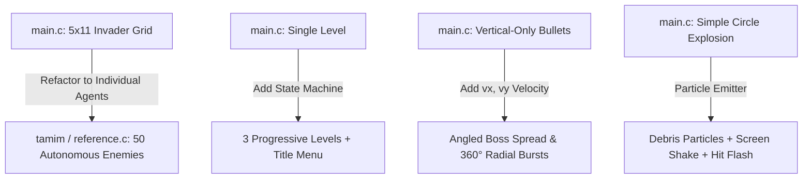

# Step-by-Step Migration Guide: Transforming `main.c` to `reference.c`

This guide explains step-by-step how to transform [main.c](file:///d:/02_CODE/06_BUET_CSE/02_GAMES/raylib_template/raylib_template/main.c) to incorporate all gameplay mechanics, multi-level progression, and the boss battle system from [reference.c](file:///d:/02_CODE/06_BUET_CSE/02_GAMES/raylib_template/raylib_template/reference.c).

---

## Overview of Key Architectural Differences



---

## Step 1: Update Includes and Constants

### 1.1 Add Math Headers
In [main.c](file:///d:/02_CODE/06_BUET_CSE/02_GAMES/raylib_template/raylib_template/main.c#L1-L2), you need trigonometric functions (`sinf`, `cosf`) and vector math for circular bullet bursts and sine-wave zigzag movement.

**In `main.c` lines 1–2:**
```c
// --- OLD (main.c) ---
#include "raylib.h"
```
**Change to:**
```c
// --- NEW ---
#include "raylib.h"
#include <math.h>
#include "raymath.h"
```

---

### 1.2 Constants (Resolution, Limits, Boss, Colors)
In `main.c` lines 3–64, modify the window size, add colors, increase bullet limits, and add constants for the Level 3 Boss and particle system.

**In `main.c` lines 3–64, replace with:**
```c
// Window settings
#define WINDOW_WIDTH 1200
#define WINDOW_HEIGHT 900

// Colors
#define SABER_GREEN (Color){255, 20, 147, 255} // Player bullet laser color
#define BG_COLOR (Color){8, 8, 12, 255}        // Deep space background

// Starfield settings
#define STAR_COUNT_FAR  150
#define STAR_COUNT_MID   80
#define STAR_COUNT_NEAR  30
#define STAR_TOTAL (STAR_COUNT_FAR + STAR_COUNT_MID + STAR_COUNT_NEAR)
#define STAR_SPEED_FAR   30.0f
#define STAR_SPEED_MID   70.0f
#define STAR_SPEED_NEAR 160.0f

// Player settings
#define PLAYER_WIDTH 120
#define PLAYER_HEIGHT 60
#define PLAYER_START_X ((WINDOW_WIDTH - PLAYER_WIDTH) / 2)
#define PLAYER_Y (WINDOW_HEIGHT - PLAYER_HEIGHT - 50)
#define PLAYER_SPEED 350.0f
#define PLAYER_MAX_X (WINDOW_WIDTH - PLAYER_WIDTH)
#define PLAYER_LIVES 3
#define PLAYER_INVINCIBLE_TIME 1.5f

// Bullet settings
#define MAX_PLAYER_BULLETS 30
#define BULLET_SPEED 1000.0f
#define BULLET_WIDTH 5
#define BULLET_HEIGHT 15
#define PLAYER_SHOOT_COOLDOWN 0.20f

#define MAX_ENEMY_BULLETS 40
#define ENEMY_BULLET_SPEED 300.0f
#define ENEMY_BULLET_WIDTH 5
#define ENEMY_BULLET_HEIGHT 15

// Enemies
#define MAX_ENEMIES 50
#define ENEMY_HITBOX 40

// Boss settings
#define BOSS_WIDTH 200
#define BOSS_HEIGHT 80
#define BOSS_MAX_HP 50
#define BOSS_BULLET_SPEED 400.0f
#define MAX_BOSS_BULLETS 50

// Particles & Screen Shake
#define MAX_PARTICLES 100
#define PARTICLE_LIFETIME 0.5f
#define SHAKE_DURATION 0.3f

// Scores & Transitions
#define SCORE_DUMMY   5
#define SCORE_BASIC  10
#define SCORE_ZIGZAG 15
#define SCORE_RAPID  20
#define SCORE_TANK   30
#define SCORE_BOSS  500
#define LEVEL_TRANSITION_TIME 2.5f
```

---

## Step 2: Refactor Data Structures and Enums

In `main.c` lines 66–136, replace the rigid grid structs with autonomous agent structs and add state enums.

### 2.1 Update `Bullet` to Support 2D Angles
```c
// --- OLD (main.c) ---
typedef struct Bullet {
    Vector2 position;
    float speed;
    bool active;
} Bullet;

// --- NEW ---
typedef struct Bullet {
    float x, y;
    float vx, vy; // Allows directional spread & 360° circular bursts
    bool active;
} Bullet;
```

### 2.2 Add `invincibleTimer` to `Player`
```c
typedef struct Player {
    Vector2 position;
    float speed;
    int width, height;
    int lives;
    float invincibleTimer; // When > 0, player blinks and ignores hits
} Player;
```

### 2.3 Expand `GameState` (From 3 States to 6 States)
```c
// --- OLD (main.c) ---
typedef enum GameState {
    PLAYING,
    GAME_WON,
    GAME_LOST
} GameState;

// --- NEW ---
typedef enum GameState {
    STATE_TITLE,            // Interactive level select menu
    STATE_LEVEL_TRANSITION, // "LEVEL X" countdown screen
    STATE_PLAYING,          // Normal enemy waves
    STATE_BOSS_FIGHT,       // Level 3 Boss battle
    STATE_GAME_WON,         // Victory screen
    STATE_GAME_LOST         // Game Over screen
} GameState;
```

### 2.4 Add `BossPhase`, `Boss`, and `Particle` Structs
Delete `EnemyGrid` and `Explosion`, then add:
```c
typedef enum BossPhase {
    BOSS_IDLE,
    BOSS_DIRECT,
    BOSS_SPREAD,
    BOSS_RAIN // Circular 360° radial burst
} BossPhase;

typedef struct Boss {
    float x, y;
    float width, height;
    int health, maxHealth;
    BossPhase phase;
    float phaseTimer;
    float attackTimer;
    float direction;
    int hitFlashFrames;
    bool active;
    bool minionSpawnFlags[3]; // Tracks spawns at 75%, 50%, and 25% HP
} Boss;

typedef struct Particle {
    float x, y;
    float vx, vy;
    float size;
    float life;
    Color color;
    bool active;
} Particle;
```

---

## Step 3: Replace Grid Helpers with Autonomous Wave & Boss Helpers

In `main.c` lines 137–218, remove `GetEnemyPosition` and `EnemyGrid`. Replace them with:

```c
static int GetEnemyScore(EnemyType t) {
    switch (t) {
    case ENEMY_DUMMY:  return SCORE_DUMMY;
    case ENEMY_BASIC:  return SCORE_BASIC;
    case ENEMY_ZIGZAG: return SCORE_ZIGZAG;
    case ENEMY_RAPID:  return SCORE_RAPID;
    case ENEMY_TANK:   return SCORE_TANK;
    default:           return 0;
    }
}

// Initialize individual enemy stats
static void InitEnemy(Enemy *e, EnemyType type, float x, float y) {
    e->type = type;
    e->x = x;
    e->y = y;
    e->active = true;
    e->direction = (GetRandomValue(0, 1) == 0) ? 1.0f : -1.0f;
    e->moveTimer = (float)GetRandomValue(0, 314) / 100.0f;
    e->hitFlashFrames = 0;

    switch (type) {
    case ENEMY_DUMMY:
        e->speed = 40.0f; e->health = 1; e->maxHealth = 1; e->shootCooldown = 999.0f;
        break;
    case ENEMY_BASIC:
        e->speed = 80.0f; e->health = 1; e->maxHealth = 1;
        e->shootCooldown = (float)GetRandomValue(20, 40) / 10.0f;
        break;
    case ENEMY_ZIGZAG:
        e->speed = 70.0f; e->health = 1; e->maxHealth = 1;
        e->shootCooldown = (float)GetRandomValue(30, 50) / 10.0f;
        break;
    case ENEMY_TANK:
        e->speed = 10.0f; e->health = 3; e->maxHealth = 3;
        e->shootCooldown = (float)GetRandomValue(20, 30) / 10.0f;
        break;
    case ENEMY_RAPID:
        e->speed = 120.0f; e->health = 1; e->maxHealth = 1;
        e->shootCooldown = (float)GetRandomValue(5, 10) / 10.0f;
        break;
    default:
        e->speed = 0; e->health = 0; e->maxHealth = 0; e->shootCooldown = 999.0f;
        break;
    }
    e->shootTimer = e->shootCooldown;
}

static int CountActiveEnemies(Enemy enemies[], int maxCount) {
    int count = 0;
    for (int i = 0; i < maxCount; i++) {
        if (enemies[i].active && enemies[i].type != ENEMY_DEAD) count++;
    }
    return count;
}

// Spawn wave layouts for Levels 1, 2, and 3
static int SpawnLevelEnemies(Enemy enemies[], int level) {
    for (int i = 0; i < MAX_ENEMIES; i++) {
        enemies[i].active = false;
        enemies[i].type = ENEMY_DEAD;
    }
    int idx = 0;
    if (level == 1) {
        EnemyType rowTypes[4] = {ENEMY_DUMMY, ENEMY_DUMMY, ENEMY_BASIC, ENEMY_RAPID};
        for (int r = 0; r < 4; r++) {
            for (int c = 0; c < 6; c++) {
                if (idx < MAX_ENEMIES) {
                    InitEnemy(&enemies[idx++], rowTypes[r], 150.0f + c * 200.0f, 80.0f + r * 80.0f);
                }
            }
        }
    } else if (level == 2) {
        EnemyType rowTypes[4] = {ENEMY_TANK, ENEMY_ZIGZAG, ENEMY_ZIGZAG, ENEMY_BASIC};
        for (int r = 0; r < 4; r++) {
            for (int c = 0; c < 7; c++) {
                if (idx < MAX_ENEMIES) {
                    InitEnemy(&enemies[idx++], rowTypes[r], 120.0f + c * 180.0f, 60.0f + r * 80.0f);
                }
            }
        }
    } else if (level == 3) {
        EnemyType rowTypes[2] = {ENEMY_RAPID, ENEMY_DUMMY};
        for (int r = 0; r < 2; r++) {
            for (int c = 0; c < 6; c++) {
                if (idx < MAX_ENEMIES) {
                    InitEnemy(&enemies[idx++], rowTypes[r], 200.0f + c * 180.0f, 60.0f + r * 80.0f);
                }
            }
        }
    }
    return idx;
}

// Boss setup
static void InitBoss(Boss *boss) {
    boss->x = (WINDOW_WIDTH - BOSS_WIDTH) / 2.0f;
    boss->y = 50.0f;
    boss->width = BOSS_WIDTH;
    boss->height = BOSS_HEIGHT;
    boss->health = BOSS_MAX_HP;
    boss->maxHealth = BOSS_MAX_HP;
    boss->phase = BOSS_IDLE;
    boss->phaseTimer = 0.0f;
    boss->attackTimer = 1.5f;
    boss->direction = 1.0f;
    boss->hitFlashFrames = 0;
    boss->active = true;
    boss->minionSpawnFlags[0] = false;
    boss->minionSpawnFlags[1] = false;
    boss->minionSpawnFlags[2] = false;
}

// Multi-color particle burst
static void SpawnParticles(Particle particles[], float px, float py, int count) {
    Color colors[4] = {RED, ORANGE, YELLOW, WHITE};
    int spawned = 0;
    for (int i = 0; i < MAX_PARTICLES && spawned < count; i++) {
        if (!particles[i].active) {
            particles[i].active = true;
            particles[i].x = px;
            particles[i].y = py;
            particles[i].vx = (float)GetRandomValue(-150, 150);
            particles[i].vy = (float)GetRandomValue(-200, 50);
            particles[i].size = (float)GetRandomValue(3, 8);
            particles[i].life = PARTICLE_LIFETIME;
            particles[i].color = colors[GetRandomValue(0, 3)];
            spawned++;
        }
    }
}

// Bullets
static void FireEnemyBullet(Bullet bullets[], float x, float y) {
    for (int i = 0; i < MAX_ENEMY_BULLETS; i++) {
        if (!bullets[i].active) {
            bullets[i].active = true;
            bullets[i].x = x; bullets[i].y = y;
            bullets[i].vx = 0; bullets[i].vy = ENEMY_BULLET_SPEED;
            break;
        }
    }
}

static void FireBossBullet(Bullet bullets[], float x, float y, float vx, float vy) {
    for (int i = 0; i < MAX_BOSS_BULLETS; i++) {
        if (!bullets[i].active) {
            bullets[i].active = true;
            bullets[i].x = x; bullets[i].y = y;
            bullets[i].vx = vx; bullets[i].vy = vy;
            break;
        }
    }
}
```

---

## Step 4: Variable Initialization in `main()`

In `main.c` lines 265–316:
1. Initialize `state = STATE_TITLE`.
2. Add `currentLevel = 1`, `transitionTimer = 0.0f`, `menuSelection = 0`.
3. Add `Boss boss = {0};` and `Bullet bossBullets[MAX_BOSS_BULLETS] = {0};`.
4. Add `Particle particles[MAX_PARTICLES] = {0};`.
5. Add `float shakeTimer = 0.0f; int shakeOffsetX = 0, shakeOffsetY = 0;`.
6. Replace `Enemy enemies[ENEMY_ROWS][ENEMY_COLS];` with `Enemy enemies[MAX_ENEMIES] = {0};`.

---

## Step 5: Background Tick Systems (Starfield, Screen Shake, Particles)

Inside the `while (!WindowShouldClose())` loop, update stars, shake offset, and particles before the main state machine:

```c
float dt = GetFrameTime();

// 1. Starfield update (runs in all states)
for (int i = 0; i < STAR_TOTAL; i++) {
    stars[i].y += stars[i].speed * dt;
    if (stars[i].y > WINDOW_HEIGHT) {
        stars[i].y = 0;
        stars[i].x = (float)GetRandomValue(0, WINDOW_WIDTH);
    }
}

// 2. Screen Shake decay
if (shakeTimer > 0.0f) {
    shakeTimer -= dt;
    shakeOffsetX = GetRandomValue(-3, 3);
    shakeOffsetY = GetRandomValue(-3, 3);
} else {
    shakeOffsetX = 0;
    shakeOffsetY = 0;
}

// 3. Particles decay
for (int i = 0; i < MAX_PARTICLES; i++) {
    if (!particles[i].active) continue;
    particles[i].life -= dt;
    if (particles[i].life <= 0.0f) {
        particles[i].active = false;
        continue;
    }
    particles[i].x += particles[i].vx * dt;
    particles[i].y += particles[i].vy * dt;
    float ratio = particles[i].life / PARTICLE_LIFETIME;
    particles[i].size = particles[i].size * ratio + 0.5f;
}
```

---

## Step 6: Refactor Update Logic to `switch (state)`

Replace `if (state == PLAYING)` and `if (state == GAME_WON ...)` with a full switch covering all 6 states:

### 6.1 `case STATE_TITLE:`
```c
case STATE_TITLE: {
    if (IsKeyPressed(KEY_UP))   menuSelection = (menuSelection + 2) % 3;
    if (IsKeyPressed(KEY_DOWN)) menuSelection = (menuSelection + 1) % 3;

    if (IsKeyPressed(KEY_ENTER)) {
        currentLevel = menuSelection + 1;
        score = 0;
        player.lives = PLAYER_LIVES;
        player.position = (Vector2){PLAYER_START_X, PLAYER_Y};
        player.invincibleTimer = 0.0f;
        boss.active = false;

        for (int i = 0; i < MAX_PLAYER_BULLETS; i++) playerBullets[i].active = false;
        for (int i = 0; i < MAX_ENEMY_BULLETS; i++) enemyBullets[i].active = false;
        for (int i = 0; i < MAX_BOSS_BULLETS; i++) bossBullets[i].active = false;
        for (int i = 0; i < MAX_PARTICLES; i++) particles[i].active = false;

        if (menuSelection == 2) { // Boss fight directly
            for (int i = 0; i < MAX_ENEMIES; i++) enemies[i].active = false;
            InitBoss(&boss);
        } else {
            SpawnLevelEnemies(enemies, currentLevel);
        }
        transitionTimer = LEVEL_TRANSITION_TIME;
        state = STATE_LEVEL_TRANSITION;
    }
    break;
}
```

### 6.2 `case STATE_LEVEL_TRANSITION:`
```c
case STATE_LEVEL_TRANSITION: {
    transitionTimer -= dt;
    if (transitionTimer <= 0.0f) {
        state = (currentLevel == 3 && boss.active) ? STATE_BOSS_FIGHT : STATE_PLAYING;
    }
    break;
}
```

### 6.3 `case STATE_PLAYING:`
* Update player movement and bullet firing (`playerBullets[i].vx = 0; playerBullets[i].vy = -BULLET_SPEED;`).
* Update each enemy according to its `type`:
  * **`ENEMY_DUMMY`**: `e->y += e->speed * dt;`
  * **`ENEMY_BASIC`**: `e->x += e->speed * e->direction * dt; e->y += 15.0f * dt;`
  * **`ENEMY_ZIGZAG`**: `e->x += sinf(e->moveTimer * 3.0f) * 120.0f * e->direction * dt; e->y += 60.0f * dt;`
  * **`ENEMY_TANK`**: `e->x += sinf(e->moveTimer * 0.5f) * 30.0f * e->direction * dt; e->y += e->speed * dt;`
  * **`ENEMY_RAPID`**: `e->x += e->speed * e->direction * dt;` (clamped to `WINDOW_HEIGHT * 0.4f`).
* Add the **enemy-to-enemy collision push** loop:
  ```c
  for (int a = 0; a < MAX_ENEMIES; a++) {
      if (!enemies[a].active) continue;
      Rectangle aRect = {enemies[a].x, enemies[a].y, ENEMY_HITBOX, ENEMY_HITBOX};
      for (int b = a + 1; b < MAX_ENEMIES; b++) {
          if (!enemies[b].active) continue;
          Rectangle bRect = {enemies[b].x, enemies[b].y, ENEMY_HITBOX, ENEMY_HITBOX};
          if (CheckCollisionRecs(aRect, bRect)) {
              float overlap = (ENEMY_HITBOX - fabsf((enemies[a].x + ENEMY_HITBOX/2) - (enemies[b].x + ENEMY_HITBOX/2))) / 2.0f;
              enemies[a].x += (enemies[a].x <= enemies[b].x) ? -overlap : overlap;
              enemies[b].x += (enemies[a].x <= enemies[b].x) ? overlap : -overlap;
              enemies[a].direction *= -1.0f;
              enemies[b].direction *= -1.0f;
          }
      }
  }
  ```
* Advance levels when `CountActiveEnemies(enemies, MAX_ENEMIES) == 0`.

### 6.4 `case STATE_BOSS_FIGHT:`
* Boss moves horizontally (`boss.x += 80.0f * boss.direction * dt`).
* Phase updates:
  * **`BOSS_IDLE`**: Wait 2s $\rightarrow$ switch to `BOSS_DIRECT`.
  * **`BOSS_DIRECT`**: Fire toward player X every 0.3s for 3s $\rightarrow$ switch to `BOSS_SPREAD`.
  * **`BOSS_SPREAD`**: Fire 3-way cone (angles 0, -120, +120) every 0.6s for 2s $\rightarrow$ switch to `BOSS_RAIN`.
  * **`BOSS_RAIN`**: Fire 16 radial bullets evenly in 360° every 1.5s:
    ```c
    int numBullets = 16;
    float angleStep = (2.0f * 3.14159265f) / numBullets;
    for (int b = 0; b < numBullets; b++) {
        float angle = angleStep * b;
        float vx = sinf(angle) * BOSS_BULLET_SPEED;
        float vy = cosf(angle) * BOSS_BULLET_SPEED;
        FireBossBullet(bossBullets, bossCenter, boss.y + boss.height / 2.0f, vx, vy);
    }
    ```
* Threshold minion checks:
  ```c
  int hpThresholds[3] = {(int)(boss.maxHealth * 0.75f), (int)(boss.maxHealth * 0.50f), (int)(boss.maxHealth * 0.25f)};
  for (int t = 0; t < 3; t++) {
      if (!boss.minionSpawnFlags[t] && boss.health <= hpThresholds[t]) {
          boss.minionSpawnFlags[t] = true;
          // Spawn 1-2 Dummies beneath boss
      }
  }
  ```

---

## Step 7: Update Drawing Logic with Shake Offset

In `main.c` line 538 onwards:
1. Define shake offsets: `int sx = shakeOffsetX; int sy = shakeOffsetY;`.
2. Add `sx` and `sy` to all draw coordinates (`x + sx, y + sy`).
3. Render state-specific interfaces inside `switch (state)`:
   * **`STATE_TITLE`**: Title banner, level options with highlight box for `menuSelection`, and blinking prompt.
   * **`STATE_LEVEL_TRANSITION`**: Semi-transparent dark overlay with `LEVEL X` and level description.
   * **`STATE_PLAYING`**: Enemy sprites with hit-flash tinting (`enemies[i].hitFlashFrames > 0 ? RED : WHITE`) and Tank health bar (`DrawRectangle(ex, ey - 8, barW, 5, RED)`).
   * **`STATE_BOSS_FIGHT`**: Boss body, cockpit, top screen health bar (`DrawRectangle(50, 15, barW * hpRatio, 14, RED)`), and orange boss bullets.
   * **`STATE_GAME_WON` / `STATE_GAME_LOST`**: Overlays prompting `Press ENTER to return to title`.

---

## Step 8: Build and Test

Compile with the Raylib link command:
```powershell
gcc -g main.c -I./raylib/raylib-6.0_win64_mingw-w64/include ./raylib/raylib-6.0_win64_mingw-w64/lib/libraylib.a -lopengl32 -lgdi32 -lwinmm "-Wl,--defsym,stat64i32=_stat64" -o main.exe
```

Run `./main.exe` to verify:
1. Title screen displays with UP/DOWN navigation.
2. Levels 1 and 2 advance through level transitions.
3. Level 3 Boss initiates attack cycles, fires 16-bullet 360° radial bursts, spawns minions on taking damage, and displays the boss health bar.
